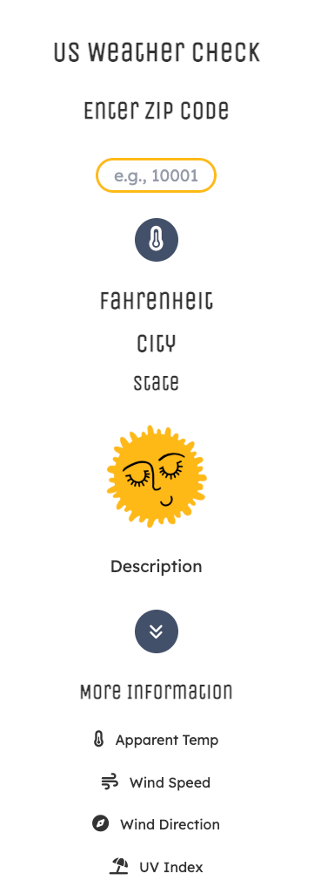
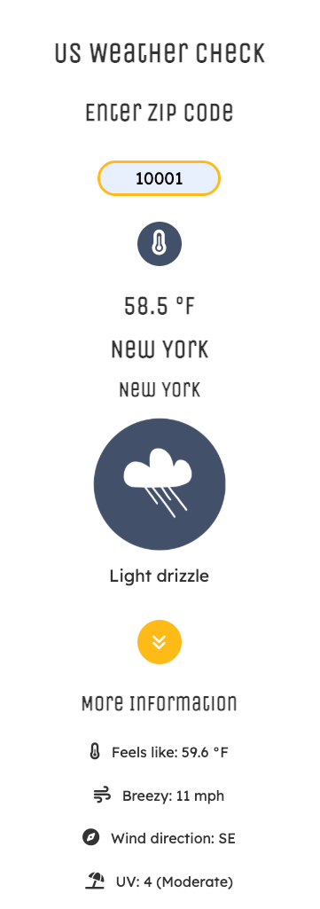

# Open API App

**_Data provided by Open-Meteo:_**

- [Open Meteo](https://open-meteo.com)
- [Open Meteo Geocoding](https://open-meteo.com/en/docs/geocoding-api)

## Live site

Check out the live demo of the project here:
[Live Site](https://codercreative.github.io/open-api-project/)

## Overview

- A simple weather app that uses Open Meteo APIs to show real-time weather data for the US based on the user's zip code input
- The app displays current temperature, city, state and an illustration based on the called api's weather code
- The user can then click on a second icon that will reveal the apparent temperature, wind speed, wind direction and UV index for the selected zip code

<p>
  
   
</p>

## How It Works

The user enters a zip code, clicks on the temperature icon and the app displays:

- The current temperature
- The city and state names
- An illustration I have designed that reflects the weather code

The user can then select the "angles-down" icon in order to display additional weather conditions:

- Apparent temperature
- Wind speed
- Wind direction
- UV index

## Key Features

- Fetches live weather data using two Open Meteo APIs from user's zip code input
- Displays various weather conditions
- Pulling API data with async/await JavaScript promises as well as helper functions

## App Checklist Examples

### API Requirement

- Added two search buttons

### HTML

- Added copyright in footer
- Reconsidered Google Fonts (Kept Unica and changed Roboto to Lexend)
- Created a favicon

### CSS

- Stored CSS and JS files in folders
- Decided that layout should be in a column on all sizes
- Centered the placeholder in the zip code input field
- Showing a default sun illustration when the app loads
- Added media queries for larger displays
- Added colors as variables in :root

### JS

- Used global variables for access in helper functions
- Corrected the image paths after placing script.js in a js folder
- Added "Just a sec..." for temp if it takes too long to load
- Added night images (to replace two images of suns if local time is night) based on isDay variable
- Decided which weather details to add from the second api async function call
- Converted celsius into fahrenheit (in more information api call)
- Used wind range based on Beaufort wind scale
- Clear user input when and placeholder when user enters a new search based on zip code

### Error message handling

- Checked for valid 5 number zip code
- Display an error message if no zip code is entered or if the input is invalid

## Future considerations

- Had issues with linear-gradient background color. Will possibly add that at a later date and overcome CSS issues (height, overlap of text, etc.)
- Example of linear-gradient code:

```css
linear-gradient(145deg, #fff085, #feba17)
```

- Optimize padding and margins even more
- When clicking outside of zip code field - be able to clear too?
